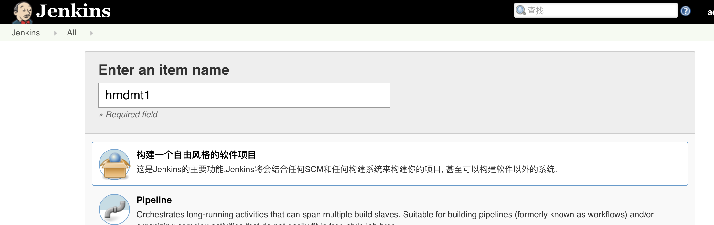
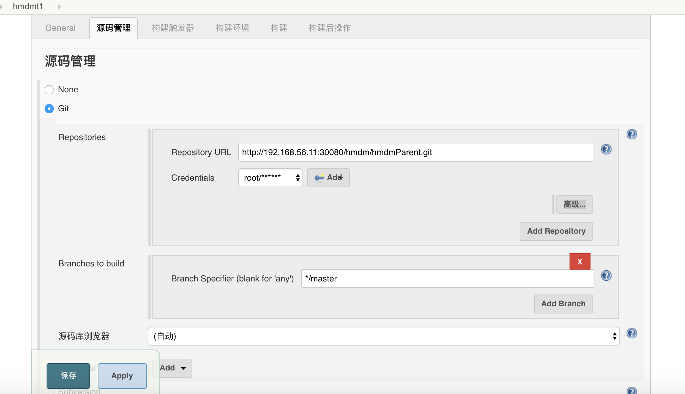
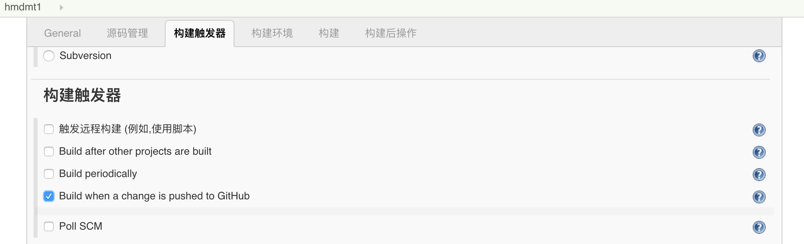
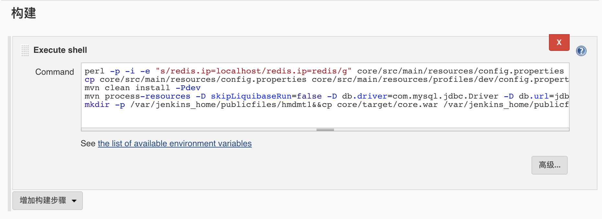
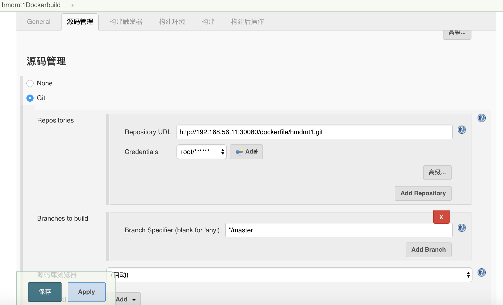
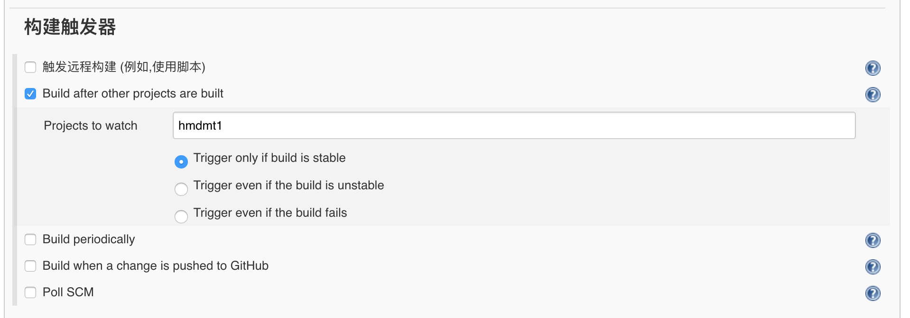
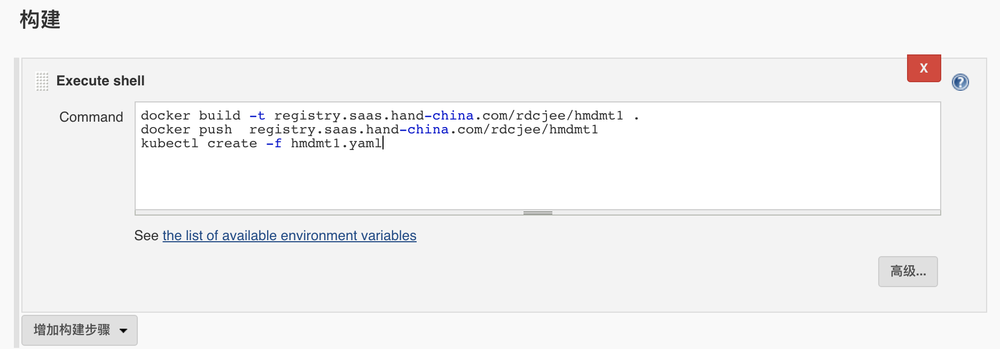

### hmdm示例应用k8s部署

> 如果环境已全部搭好，请忽略前面3步！

#### 部署jenkins

参考[Jenkins部署](jenkins.md)

#### 部署nginx文件服务器

参考[nginx-file-server部署](nginx-file-server.md)

#### 部署gitlab

参考[Gitlab部署](gitlab.md)

#### hmdm部署

1. 首先，新建项目，选择自由风格的软件项目，输入名字：


2. 源码管理。这里使用git,`Repository URL`为仓库地址，`Credentials`为克隆代码的用户，`Branch Specifier`选择要构建的分支。


3. 构建触发器，当勾选当前选项时，每当gitlab上有代码提交，就会出发构建。


4. 点击构建，选择`Excute shell`

```
# 修改redis地址
perl -p -i -e "s/redis.ip=localhost/redis.ip=redis/g" core/src/main/resources/config.properties
# 复制到dev
cp core/src/main/resources/config.properties core/src/main/resources/profiles/dev/config.properties
# 清除安装依赖和选择环境dev
mvn clean install -Pdev
# 初始化数据库,数据库地址为mysql服务的集群ip地址
mvn process-resources -D skipLiquibaseRun=false -D db.driver=com.mysql.jdbc.Driver -D db.url=jdbc:mysql://10.97.248.250:3306/hap_dev -Ddb.user=hap_dev -Ddb.password=hap_dev
# 将生存的war包，复制到文件服务器目录下
mkdir -p /var/jenkins_home/publicfiles/hmdmt1&&cp core/target/core.war /var/jenkins_home/publicfiles/hmdmt1/core.war
```

5. 创建上一步中的，数据库和用户

```
# 修改mysql配置(见mysql部署)
lower_case_table_names=1
character_set_server=utf8
max_connections=500
# 用管理员登陆mysql，创建数据库hap_dev与hap_prod
create schema hap_dev default character set utf8;
create schema hap_prod default character set utf8; 
# 创建用户hap_dev,并将密码设置为hap_dev
CREATE USER hap_dev@'%' IDENTIFIED BY 'hap_dev';
CREATE USER hap_dev@'localhost' IDENTIFIED BY 'hap_dev';
# 将上面新建的hap_dev和hap_prod的权限全部赋予用户hap
GRANT ALL PRIVILEGES ON hap_dev.* TO hap_dev@'%';
GRANT ALL PRIVILEGES ON hap_dev.* TO hap_dev@'localhost';
GRANT ALL PRIVILEGES ON hap_prod.* TO hap_dev@'%';
GRANT ALL PRIVILEGES ON hap_prod.* TO hap_dev@'localhost';

flush privileges;
```

6. 点击保存

7. 再新建一个项目`hmdmt1Dockerbuild`

8. 编写`Dockerfile`和`hmdmt1.yaml`文件并提交到gitlab
```
FROM tomcat:8.5.2-jre8

MAINTAINER jianwu.bin@hand-china.com

ADD context.xml /usr/local/tomcat/conf/

ADD http://192.168.56.11:31187/hmdmt1/core.war /usr/local/tomcat/webapps/
```

`context.xml`配置(jndi)如下:
```
<?xml version="1.0" encoding="UTF-8"?>
<!--
  Licensed to the Apache Software Foundation (ASF) under one or more
  contributor license agreements.  See the NOTICE file distributed with
  this work for additional information regarding copyright ownership.
  The ASF licenses this file to You under the Apache License, Version 2.0
  (the "License"); you may not use this file except in compliance with
  the License.  You may obtain a copy of the License at

      http://www.apache.org/licenses/LICENSE-2.0

  Unless required by applicable law or agreed to in writing, software
  distributed under the License is distributed on an "AS IS" BASIS,
  WITHOUT WARRANTIES OR CONDITIONS OF ANY KIND, either express or implied.
  See the License for the specific language governing permissions and
  limitations under the License.
--><!-- The contents of this file will be loaded for each web application -->
<Context>

    <!-- Default set of monitored resources. If one of these changes, the    -->
    <!-- web application will be reloaded.                                   -->
    <WatchedResource>WEB-INF/web.xml</WatchedResource>
    <WatchedResource>${catalina.base}/conf/web.xml</WatchedResource>

    <!-- Uncomment this to disable session persistence across Tomcat restarts -->
    <!--
    <Manager pathname="" />
    -->

    <!-- Uncomment this to enable Comet connection tacking (provides events
         on session expiration as well as webapp lifecycle) -->
    <!--
    <Valve className="org.apache.catalina.valves.CometConnectionManagerValve" />
    -->
    <Resource auth="Container" driverClassName="com.mysql.jdbc.Driver" name="jdbc/hap_dev" password="hap_dev" type="javax.sql.DataSource" url="jdbc:mysql://10.97.248.250:3306/hap_dev?characterEncoding=UTF-8" username="hap_dev"/>
</Context>
```
`hmdmt1.yaml`:

```
kind: Namespace
apiVersion: v1
metadata:
    name: hmdmt1

---

kind: Deployment
apiVersion: extensions/v1beta1
metadata:
  name: redis
  namespace: hmdmt1
spec:
  replicas: 1
  template:
    metadata:
      labels:
        app: redis
    spec:
      containers:
      - name: redis
        image: registry.saas.hand-china.com/tools/redis:latest
        imagePullPolicy: IfNotPresent
        ports:
        - containerPort: 6379
          name: redis
        volumeMounts:
        - name: redis-home
          mountPath: /var/lib/redis:Z
      volumes:
         - name: redis-home
           hostPath:
            path: /srv/docker/hmdm/redis

---

kind: Service
apiVersion: v1
metadata:
  labels:
    app: redis
  name: redis
  namespace: hmdmt1
spec:
  type: ClusterIP
  ports:
  - port: 6379
    targetPort: 6379
    protocol: TCP
  selector:
    app: redis

---

kind: Deployment
apiVersion: extensions/v1beta1
metadata:
  name: hmdmservice
  namespace: hmdmt1
spec:
  replicas: 1
  template:
    metadata:
      labels:
        app: hmdmservice
    spec:
      containers:
      - name: hmdmservice
        image: registry.saas.hand-china.com/rdcjee/hmdmt1
        imagePullPolicy: IfNotPresent
        ports:
        - containerPort: 8080
          name: hmdmservice
       
---
kind: Service
apiVersion: v1
metadata:
  labels:
    app: hmdmservice
  name: hmdmservice
  namespace: hmdmt1
spec:
  type: NodePort
  ports:
  - port: 8080
    targetPort: 8080
    protocol: TCP
  selector:
    app: hmdmservice

```

9.  源码管理，选择git，并指向刚刚提交的项目


10. 构建出发器,如图选择


11. 构建,选择执行shell


12. 保存，返回点击hmdmt1,点击立即构建
> 如果无法`kubectl create`，请将`master`节点的`/etc/kubernetes/admin.conf`文件复制到jenkins节点的jenkins用户主目录`.kube`下,并命名为`config`

13. 浏览
```
# 查询端口
kubectl get svc -n hmdmt1
```