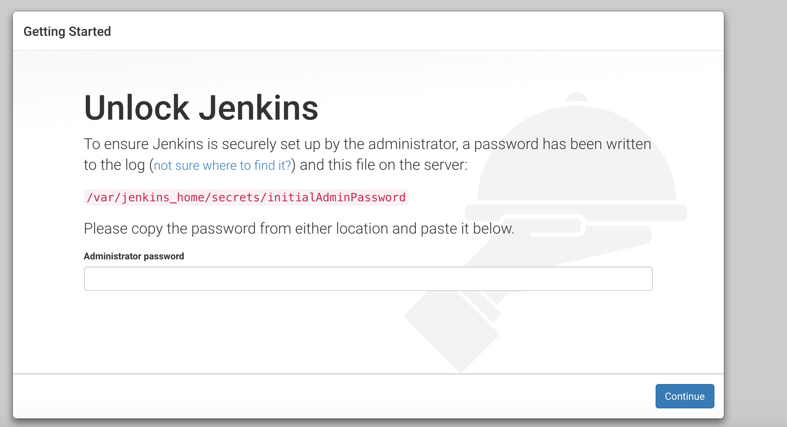
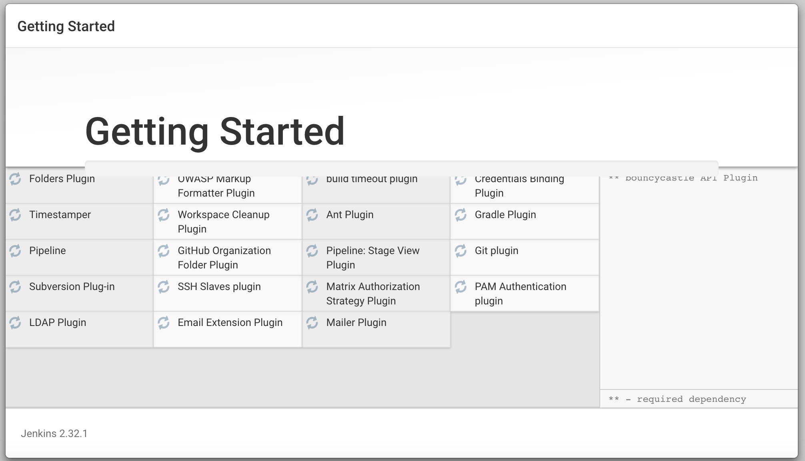
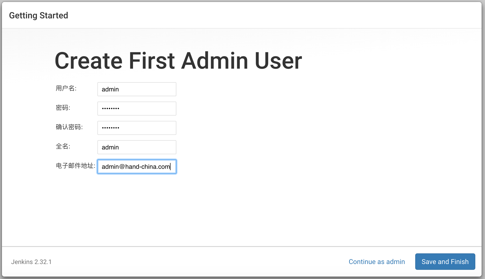
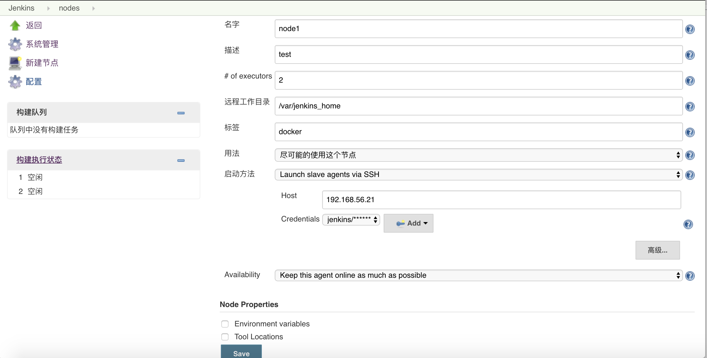

### Jenkins部署


1. #### 编写jenkins.yaml文件
```
kind: Namespace
apiVersion: v1
metadata:
    name: jenkins
---
kind: Deployment
apiVersion: extensions/v1beta1
metadata:
  name: jenkins
  namespace: jenkins
spec:
  replicas: 1
  strategy:
    type: RollingUpdate
    rollingUpdate:
      maxSurge: 2
      maxUnavailable: 0
  template:
    metadata:
      labels:
        app: jenkins
      annotations:
        scheduler.alpha.kubernetes.io/affinity: '{"nodeAffinity":{"requiredDuringSchedulingIgnoredDuringExecution":{"nodeSelectorTerms":[{"matchExpressions":[{"key":"kubernetes.io/hostname","operator":"In","values":["k8s-master"]}]}]}}}'
        scheduler.alpha.kubernetes.io/tolerations: '[{"key":"dedicated","value":"master","effect":"NoSchedule"}]'
    spec:
      imagePullSecrets:
      - name: myregistrykey
      containers:
      - name: jenkins
        image: registry.saas.hand-china.com/tools/jenkins:2.32.1
        imagePullPolicy: IfNotPresent
        ports:
        - containerPort: 8080
          name: web
          protocol: TCP
        - containerPort: 8081
          name: agent
          protocol: TCP
        volumeMounts:
        - name: jenkins-home
          mountPath: /var/jenkins_home
        env:
        - name: JAVA_OPTS
          value: "-Duser.timezone=Asia/Shanghai"
      volumes:
        - name: jenkins-home
          hostPath:
            path: /var/jenkins_home

---
kind: Service
apiVersion: v1
metadata:
  labels:
      app: jenkins
  name: jenkins
  namespace: jenkins
spec:
  type: NodePort
  ports:
  - port: 8080
    targetPort: 8080
    name: web
  - port: 8081
    targetPort: 8081
    name: agent
  selector:
    app: jenkins
```
> 注意：`annotations`中通过`kubernetes.io/hostname=k8s-master`指定了主机部署，目前使用hostPath卷将容器数据映射到了主机目录`/var/jenkins_home`。

2. #### 创建
```
# 创建/var/jenkins_home目录,并赋予所有人读写权限
$ mkdir /var/jenkins_home && chmod -R 777 /var/jenkins_home
# 创建jenkisn
$ kubectl create -f jenkins.yaml
deployment "jenkins" created
service "jenkins" created
```
3. #### 查看主机IP和分配到主机的端口
```
# 查看主机
$ hostname -i
192.168.56.11
# 查看端口
$ kubectl describe svc jenkins -n jenkins | grep NodePort | grep web
NodePort:		web	32201/TCP
```
4. 初始化配置

访问`192.168.56.11:32201`,如图所示：


查看初始密码,并输入继续。
```
$ cat /var/jenkins_home/secrets/initialAdminPassword
10376fe1e1b54e998e57db18a8d7f9bd
```
安装推荐插件


然后创建用户，如下:



5. #### 添加节点

现在，将k8s中一台worker主机，添加为jenkins的其中一个节点。首先，配置一下worker节点的基本环境。
```
# 安装jdk(可选)
$ yum install -y java-1.8.0-openjdk.x86_64
# 安装maven(可选)
$ yum install -y maven
# 创建jenkins用户
$ useradd jenkins
# 修改密码
$ passwd jenkins
# 将用户添加到docker组
$ groupadd docker
$ usermod -aG docker jenkins
# 创建节点工作目录，并赋予操作权限(目录自定义)
$ mkdir /var/jenkins_home && chmod -R 777 /var/jenkins_home
```
点击系统管理->新建节点，输入节点名字,并勾选`Permanent Agent`,点击ok。
配置如下图所示：

点击保存后，节点会自动连接运行。
> 注意:运行工作目录为上面创建的目录，Host为节点的ip地址，ssh用户是刚刚上面创建的用户。

这里我们主要使用node1节点进行构建，所以我们将master节点的执行者数量设置为0即可(根据自己需要进行配置)