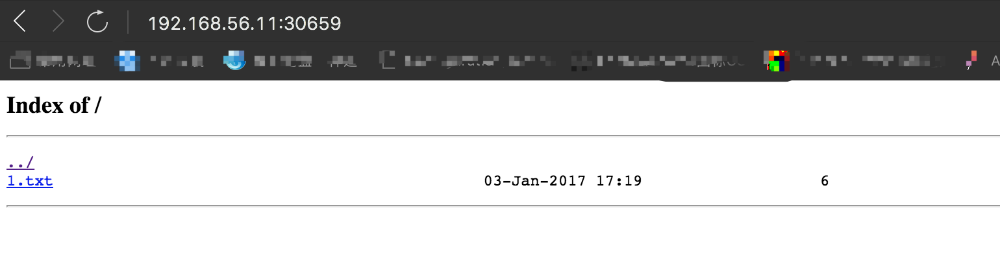

### 部署nginx文件服务器

1. 编写Dockerfile
```
FROM nginx

MAINTAINER jianwu.bin@hand-china.com

RUN echo "Asia/shanghai" > /etc/timezone;

ADD default.conf /etc/nginx/conf.d/default.conf

VOLUME ["/var/jenkins_home"]

CMD ["nginx", "-g", "daemon off;"]
```
其中修改了nginx的配置文件`default.conf`，内容如下：
```
server {
    listen       80;
    server_name  localhost;
    location / {
        root   /var/jenkins_home/publicfiles;
        index  index.html index.htm;
        autoindex on; 
        autoindex_exact_size on; 
        autoindex_localtime on;   
    }
    error_page   500 502 503 504  /50x.html;
    location = /50x.html {
        root   /usr/share/nginx/html;
    }
}
```

2. 构建镜像
```
$ docker build ./ -t nginxfileserver .
```
3. 编写`file-server.yaml`文件
```
kind: Deployment
apiVersion: extensions/v1beta1
metadata:
  name: file-server
  namespace: default
spec:
  strategy:
    type: Recreate
  template:
    metadata:
      labels:
        app: file-server
      annotations:
        scheduler.alpha.kubernetes.io/affinity: '{"nodeAffinity":{"requiredDuringSchedulingIgnoredDuringExecution":{"nodeSelectorTerms":[{"matchExpressions":[{"key":"kubernetes.io/hostname","operator":"In","values":["k8s-worker1"]}]}]}}}'
        scheduler.alpha.kubernetes.io/tolerations: '[{"key":"dedicated","value":"master","effect":"NoSchedule"}]'
    spec:
      containers:
      - name: file-server
        image: nginxfileserver
        imagePullPolicy: IfNotPresent
        ports:
        - containerPort: 80
          name: file-server
        volumeMounts:
        - name: jenkins-file-store
          mountPath: /var/jenkins_home
      volumes:
         - name: jenkins-file-store
           hostPath:
            path: /var/jenkins_home

---
kind: Service
apiVersion: v1
metadata:
  labels:
    app: file-server
  name: file-server
  namespace: default
spec:
  type: NodePort
  ports:
  - port: 80
    protocol: TCP
  selector:
    app: file-server
```
> 注意:nginx文件服务器挂载的卷目录就是jenkins节点的工作目录，并为同一台主机。

4. 创建并浏览
```
# 部署
$ kuberctl create -f file-server.yaml
# 创建目录和示例文件
$ mkdir /var/jenkins_home/publicfiles
$ cd /var/jenkins_home/publicfiles
$ echo "hello" > 1.txt
# 查看映射的主机端口
$ kubectl describe svc file-server | grep NodePort
Type:			NodePort
NodePort:		<unset>	30659/TCP
# 查看master主机ip
$ hostname -i
192.168.56.11
# 访问http://192.168.56.11:30659
```
界面截图：
